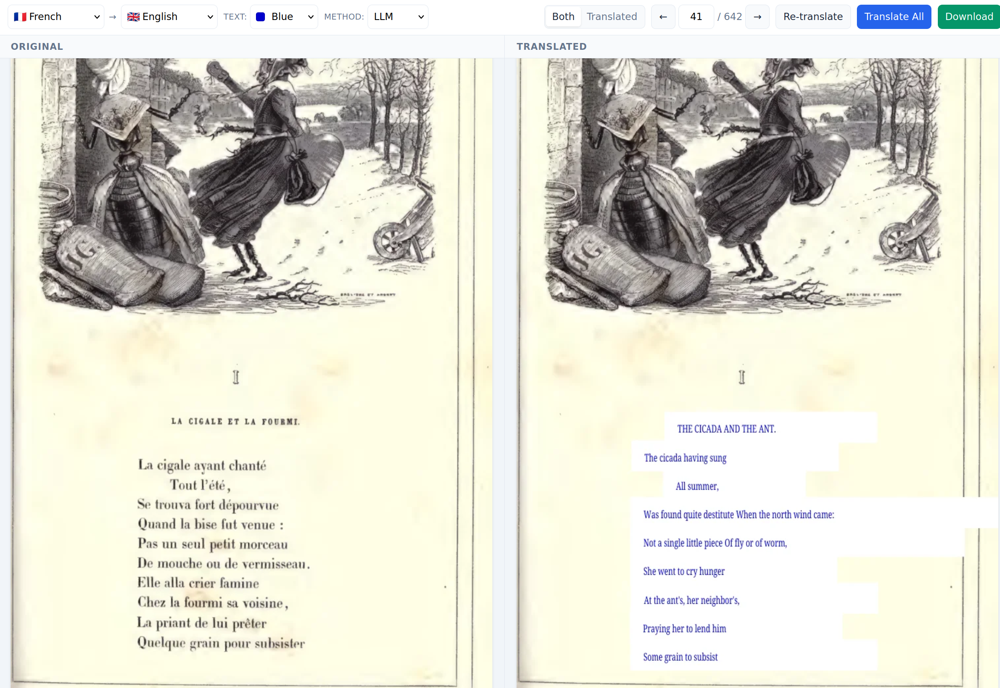

# PDF Translator

A fast, local-first PDF translator with side-by-side viewing. Translate PDF documents page-by-page using local LLMs or cloud APIs while preserving the original layout with figures and images.

> **Note**: This project was built almost entirely through AI-assisted development using [Claude Code](https://github.com/anthropics/claude-code). The human's role was primarily direction, feedback, and review rather than writing code directly.



## Motivation

Most PDF translation tools just extract text and translate it, losing all the figures, diagrams, and layout. This tool renders each page as an image, extracts text blocks with their positions, translates them, and overlays the translations back onto the original. You get side-by-side viewing with everything intact.

- **Local-first**: Works with local LLMs (llama.cpp) - no data leaves your machine
- **Page-by-page**: Only translate what you're reading
- **Preserves layout**: Figures, images, and formatting stay visible

Inspired by [pdf-translator-for-human](https://github.com/davideuler/pdf-translator-for-human), reimplemented in Rust.

## Features

- **Web Interface**: Side-by-side view of original and translated pages, translate on demand
- **CLI Tool**: Batch translate entire documents
- **OpenAI-compatible APIs**: Works with llama.cpp, DeepSeek, OpenAI, etc.
- **Output languages**: English, French, German, Spanish, Italian, Portuguese

## Usage

Requires [Nix](https://nixos.org/) with flakes enabled.

### Quick Start (Local LLM)

```bash
# Start a local LLM server (models downloaded automatically from HuggingFace)
nix run github:carjorvaz/pdf-translator-rs#serve-model            # Qwen3-4B (recommended)
nix run github:carjorvaz/pdf-translator-rs#serve-model -- small   # Qwen3-1.7B (~1.1GB, low RAM)
nix run github:carjorvaz/pdf-translator-rs#serve-model -- quality # Qwen3-8B (~5.1GB, better quality)

# In another terminal, start the web interface
nix run github:carjorvaz/pdf-translator-rs#web
```

Then open http://localhost:3000.

### Cloud APIs

For DeepSeek, OpenAI, or other cloud providers, set credentials via environment or a `.env` file:

```bash
OPENAI_API_KEY=your-key
OPENAI_API_BASE=https://api.deepseek.com/v1  # defaults to localhost:8080
OPENAI_MODEL=deepseek-chat
```

```bash
nix run github:carjorvaz/pdf-translator-rs#web
```

### CLI

For batch translation of entire documents:

```bash
nix run github:carjorvaz/pdf-translator-rs#cli -- input.pdf --source fr --target en -o translated.pdf

# Translate specific pages only
nix run github:carjorvaz/pdf-translator-rs#cli -- input.pdf --pages 1-10 --source de --target en
```

### NixOS Module

For server deployment:

```nix
# flake.nix
{
  inputs.pdf-translator.url = "github:carjorvaz/pdf-translator-rs";
}

# configuration.nix
{ inputs, ... }:
{
  imports = [ inputs.pdf-translator.nixosModules.pdf-translator ];

  services.pdf-translator = {
    enable = true;
    host = "0.0.0.0";
    port = 3000;
    openFirewall = true;
    apiBase = "http://localhost:8080/v1";  # Your LLM server
    # apiKeyFile = /run/secrets/openai-api-key;  # Optional
  };
}
```

## Limitations

- **Output languages**: English, French, German, Spanish, Italian, Portuguese only (PDF font encoding limitation).
- **Text extraction**: Works best with PDFs that have embedded text. Scanned documents need OCR preprocessing (e.g., [Tesseract](https://github.com/tesseract-ocr/tesseract)).

## Design

The web UI uses [HTMX](https://htmx.org/) following hypermedia/HATEOAS principles - the server returns HTML fragments directly, no JSON APIs or client-side state management.

## Bundled Assets

This project includes [Noto Serif](https://fonts.google.com/noto/specimen/Noto+Serif) by Google, licensed under the [SIL Open Font License 1.1](crates/pdf-translator-core/assets/OFL.txt). The font is embedded in the binary for PDF text rendering.

## License

AGPL-3.0 - See [LICENSE](LICENSE) for details.
