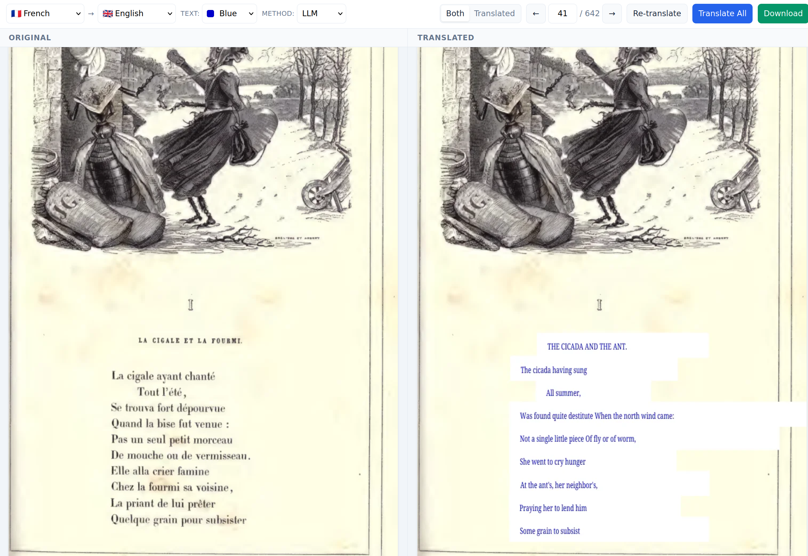

# PDF Translator

A fast, local-first PDF translator with side-by-side viewing. Translate PDF documents page-by-page using local LLMs or cloud APIs while preserving the original layout with figures and images.

> **Note**: This project was built almost entirely through AI-assisted development using [Claude Code](https://github.com/anthropics/claude-code). The human's role was primarily direction, feedback, and review rather than writing code directly.



## Motivation

Most PDF translation tools just extract text and translate it, losing all the figures, diagrams, and layout. This tool renders each page as an image, extracts text blocks with their positions, translates them, and overlays the translations back onto the original. You get side-by-side viewing with everything intact.

- **Local-first**: Works with local LLMs (llama.cpp) - no data leaves your machine
- **Page-by-page**: Only translate what you're reading
- **Preserves layout**: Figures, images, and formatting stay visible

Inspired by [pdf-translator-for-human](https://github.com/davideuler/pdf-translator-for-human), reimplemented in Rust.

## Features

- **Web Interface**: Side-by-side view of original and translated pages, translate on demand
- **CLI Tool**: Batch translate entire documents
- **OpenAI-compatible APIs**: Works with llama.cpp, DeepSeek, OpenAI, etc.
- **Output languages**: English, French, German, Spanish, Italian, Portuguese

## Usage

### With Nix

Requires [Nix](https://nixos.org/) with flakes enabled.

```bash
# Start a local LLM server (models download automatically from Hugging Face).
nix run github:carjorvaz/pdf-translator-rs#serve-model

# In another terminal, start the web interface.
nix run github:carjorvaz/pdf-translator-rs#web
```

The model server defaults to Qwen3-4B. Pass `small` for Qwen3-1.7B or `quality`
for Qwen3-8B:

```bash
nix run github:carjorvaz/pdf-translator-rs#serve-model -- small
```

Then open http://localhost:3000.

For batch translation, run the `cli` app (which executes `pdf-translate`):

```bash
nix run github:carjorvaz/pdf-translator-rs#cli -- input.pdf --source fr --target en --output translated.pdf

# Translate specific pages only.
nix run github:carjorvaz/pdf-translator-rs#cli -- input.pdf --pages 1-10 --source de --target en
```

### From source

With Rust and the native dependencies installed, use the binaries' actual names:

```bash
cargo run --bin pdf-translator-web
cargo run --bin pdf-translate -- input.pdf --source fr --target en --output translated.pdf
```

### Cloud APIs

Both binaries load an ignored `.env` file when present and otherwise read the
process environment. For a cloud provider, enter the key at runtime so it is
not written to this repository, then export all OpenAI-compatible settings:

```bash
printf 'API key: '
IFS= read -r -s OPENAI_API_KEY
printf '\n'
export OPENAI_API_KEY
export OPENAI_API_BASE='https://api.deepseek.com/v1'
export OPENAI_MODEL='deepseek-chat'

nix run github:carjorvaz/pdf-translator-rs#web
```

For OpenAI, use `https://api.openai.com/v1` and an OpenAI model name instead.
Local llama.cpp defaults require no key: `OPENAI_API_BASE` defaults to
`http://localhost:8080/v1` and `OPENAI_MODEL` defaults to `default_model`.

### CLI configuration

`config.example.toml` documents the CLI configuration file. Pass an exact file
with `--config PATH`. Without `--config`, `pdf-translate` first tries
`$XDG_CONFIG_HOME/pdf-translator/config.toml` (or
`$HOME/.config/pdf-translator/config.toml`) and then `./config.toml`; it uses
the first valid file found, or built-in defaults if neither can be loaded.

The CLI loads `.env` before parsing options. Existing process environment
values take precedence over `.env`. `OPENAI_API_BASE`, `OPENAI_API_KEY`, and
`OPENAI_MODEL` override the corresponding file values, and explicit CLI flags
override both environment and file values. Other explicit flags such as
`--source`, `--target`, and `--color` override their file values. When a flag
or its corresponding environment variable is absent, the loaded configuration
value is preserved. The web binary does not read `config.toml`; configure it
with its CLI flags and the environment variables shown above.

### NixOS Module

For server deployment:

```nix
# flake.nix
{
  inputs.pdf-translator.url = "github:carjorvaz/pdf-translator-rs";
}

# configuration.nix
{ inputs, ... }:
{
  imports = [ inputs.pdf-translator.nixosModules.pdf-translator ];

  services.pdf-translator = {
    enable = true;
    host = "127.0.0.1";
    port = 3000;
    apiBase = "http://localhost:8080/v1";  # Your LLM server
    # apiKeyFile = /run/secrets/openai-api-key;  # Optional
  };
}
```

The service deliberately accepts only loopback bind addresses. Keep that
boundary and publish it through a TLS reverse proxy that enforces
authentication. For example, generate a password hash with
`caddy hash-password`, replace the placeholder below, and let Caddy own the
public ports:

```nix
services.caddy = {
  enable = true;
  virtualHosts."translate.example.com".extraConfig = ''
    @invalidOrigin {
      method POST PUT PATCH DELETE
      not header Origin https://translate.example.com
    }
    respond @invalidOrigin 403

    basic_auth {
      translator REPLACE_WITH_CADDY_BCRYPT_HASH
    }
    reverse_proxy 127.0.0.1:3000
  '';
};

networking.firewall.allowedTCPPorts = [ 80 443 ];
```

Do not expose port 3000 or bind the application to a public address. Keep the
proxy and application on the same host, terminate TLS at the proxy, and retain
the exact unsafe-method `Origin` check when changing authentication. The basic
authentication example is suitable for trusted personal access; use an
identity-aware proxy with the same origin policy for multi-user deployments.

### Live provider smoke test

The manual `Live provider smoke` GitHub Actions workflow translates the
committed test PDF through the real CLI and verifies a non-empty PDF result.
Configure its `live-provider` environment with the `OPENAI_API_KEY` secret and
the `OPENAI_API_BASE` and `OPENAI_MODEL` variables. It is never triggered by
pull requests or ordinary pushes.

## Limitations

- **Output languages**: English, French, German, Spanish, Italian, Portuguese only (PDF font encoding limitation).
- **Text extraction**: Works best with PDFs that have embedded text. Scanned documents need OCR preprocessing (e.g., [Tesseract](https://github.com/tesseract-ocr/tesseract)).

## Design

The web UI uses [HTMX](https://htmx.org/) following hypermedia/HATEOAS principles - the server returns HTML fragments directly, no JSON APIs or client-side state management.

## Bundled Assets

This project includes [Noto Serif](https://fonts.google.com/noto/specimen/Noto+Serif) by Google, licensed under the [SIL Open Font License 1.1](crates/pdf-translator-core/assets/OFL.txt). The font is embedded in the binary for PDF text rendering.

## License

AGPL-3.0 - See [LICENSE](LICENSE) for details.
